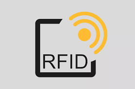
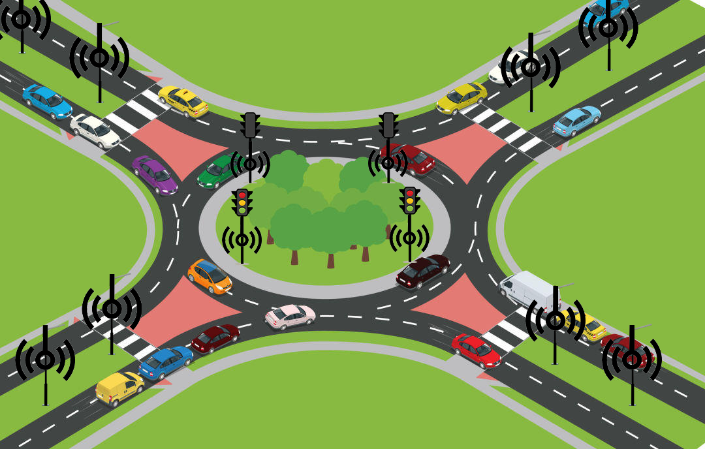

# smart_sadak

Smart Sadak System aims to automate the monitoring of the direction of driving vehicles and determining their speed and vehicle details so as to ensure safety of drivers and pedestrians and to  regulate traffic rules around the city.
  The aim is to use data logged by RFID sensors strategically placed at various parts of the road to:
1. Sense overspeeding and send an instant message to the vehicle owner.
2. Determine the wrong-way violation by the vehicles and send an instant message to the vehicle owner.
3. Detect violation of traffic signal and send an instant notification to the vehicle owner about the offence.
4. Estimate the congestion level on roads and automatically adjust the traffic light timings smartly.
5. Determine the vehicle details passing through the smart sadak.

Detect violation of traffic signal.
A third RFID sensor is placed at the traffic signal to detect whether a vehicle is disobeying the traffic signal and an instant notification is sent to the owner.

Future Enhancements :

After detecting emergency vehicles, the traffic signal timing is modified so that the emergency vehicle gets passage on the highest priority.
Statistical analysis of the data gathered and report generation to help in monitoring.
Locating offenders by detecting their vehicles using RFIDs to aid authorities. 
Securing data using Cloud-Based Technologies and Artificial Intelligence to make the system centrally manageable and scalable without the traditional support and costs.  

